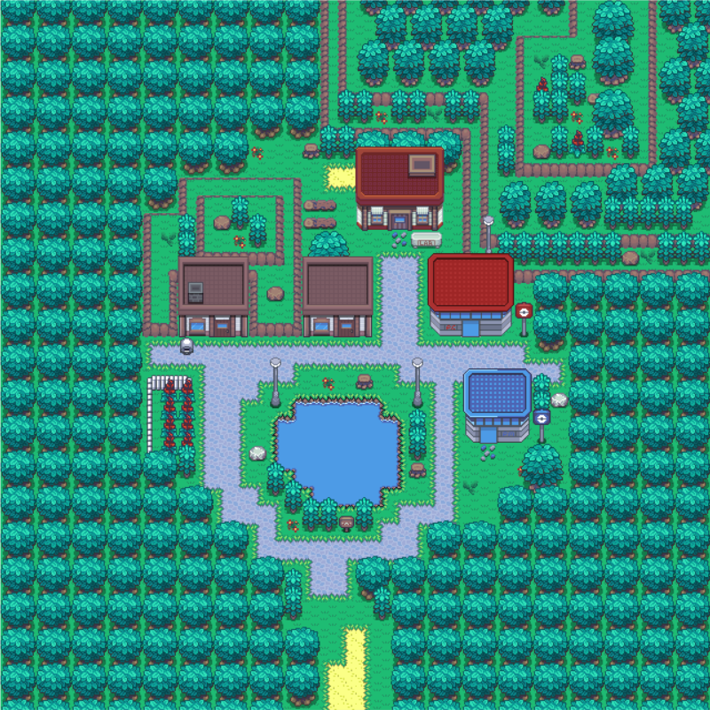
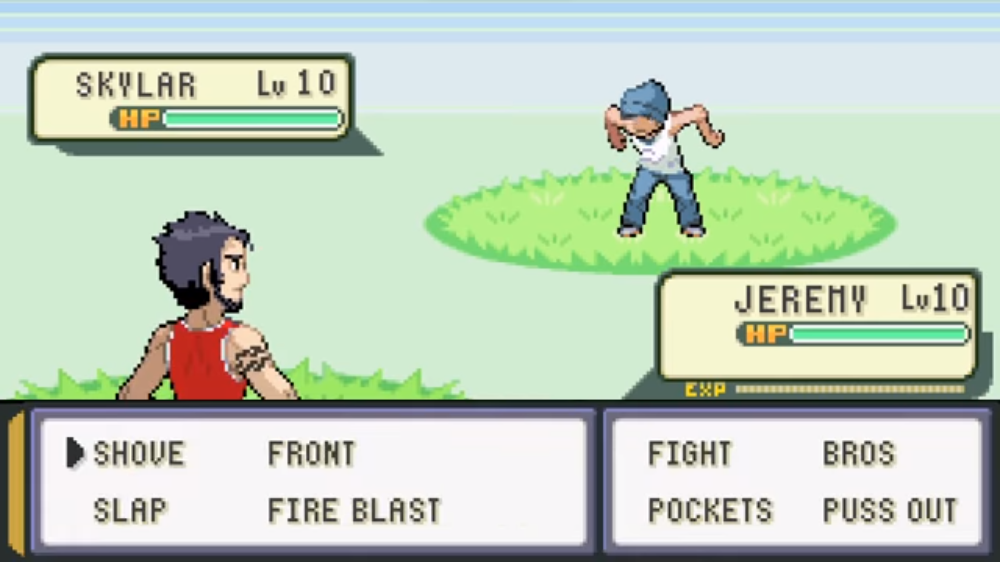

# Student Trainer

---

---

## Opis świata Gry

Jesteś wysłannikiem Rektorów AGH by zrobić porządek z rozprzestrzeniającym się chaosem wśród akademików. Akademikami zawładnęła mafia, która przedaje mieszkania na wolnym rynku tym samym pozbywając studentów miejsca zamieszkania. Ty wraz z grupą studentów próbujesz odbić wszystkie akademiki i tym samym zniszczyć nielegalną organizację.

Rozgrywka w dużej mierze odbywa się zgodnie z klasycznym nurtem RPG. Po stworzeniu postaci zaczynamy wędrówkę, kompletując drużynę, wykonując zadania i zdobywając kolejne poziomy doświadczenia. Tradycyjne rozwiązania, takie jak system ekwipunku, craftingu i niemal nieograniczonego systemu rozwoju postaci.
Turowy system walki daje możliwość decydowania o ruchu każdej z postaci gracza. Możemy nawiązać dialog praktycznie z każdą postacią, która występuje w grze.

Zbierz 6 ludzi, który będą towarzyszyć ci podczas twojej podróży.
Każdy z studentów posiada specjalne umiejętności związane z kierunkiem ich kształcenia.
Studenci:
  - Wiertnictwa - ataki oparte na ziemi
  - Energetyka - ataki oparte na ogniu
  - Metalurgii - ataki oparte na materiałach
  - Fizyki - ataki oparte na siłach fizycznych
  - Automatyka - ataki oparte na robotach
  - Informatyka - ataki oparte na programowaniu
  - ...

Każdy z kierunków studentów jest odporny na odkreślone typy ataków oraz podatny na inne.

Walka odbywa się turowo poprzez wybór 1 z 4 ruchów postaci (Podobna do walki w Pokemonach). 
Po utraceniu paska życia postać przestaje być zdolna do walki. 
Bez żadnej postaci mogącej kontynuować rozgrywkę gracz przegrywa by następnie rozpocząć rozgrywkę od początku.

Postać może zapatrzeć się lub własnoręcznie stworzyć ekwipunek, który zwiększy efektywność postaci w czasie walki
Każda wygraną walkę zdobywamy punkty doświadczenia oraz pieniądze od poległych wrogów, które można wykorzystać do ulepszenia drużyny.

---

## Główny Bohater

Trzecioroczny student Adam, który musi wykonać zlecone mu zadanie by nie zostać wydalonym z uczelni. 

---

## Grafiki koncepcyjne

### Styl Gry

### Obszar AGH na którym odbywa się gra

### Walka

---

## Gatunek oraz Styl

- **Gatunek** - RPG
- **Rodzaj Grafiki** - Pixel Art
- **Widok** - Izometryczny

---

## Mechanika wyróżniająca grę

7 różnych typów umiejętności specjalnych, które dają aż 49 możliwych kombinacji walk z których każda z nich ma określone podatności oraz odporności. 
Możemy nawiązać dialog praktycznie z każdą postacią, która występuje w grze, niektóre dialogi wpływają na przebieg dalszej rozgrywki.

---

## Używane Technologie

- **Silnik**: Unity
- **Edytor Graficzny:** Photoshop, Blender

---

## Marketing oraz Monetyzacja

- **Grupa Docelowa** - 14-35
- **Monetyzacja** - Reklamy

---

# [--> Pełna Dokumentacja <--](/GDD/GDD.md)
